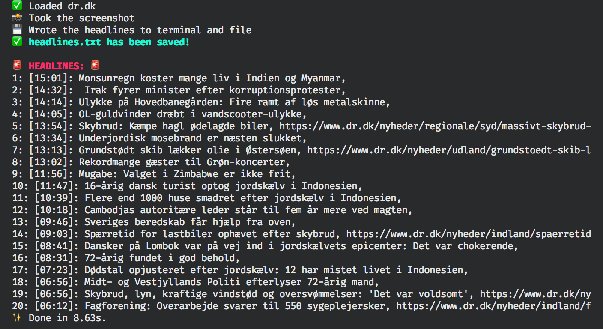

# Get news from DR in your terminal.

* Tiny test project to learn Puppeteer and try some light web scraping*

This is a small script to view the top 20 newest headlines from DR.dk in your command line interface. 
Escape the clutter and attention grabbing bling from the website and just get the headlines.

# To install:
`yarn install`

# To run:
`yarn start`

### This will
1) launch a Chromium Puppeteer instance
2) click OK to the cookie notification on the webpage
3) screenshot the page and save it to root directory
4) loop through the headlines
5) ...print them to the console and
6) ... save them to headlines.txt

 

 

I am not in any way associated with DR and just used their page as reference to practice on and because it is still the best source of news in the country.
